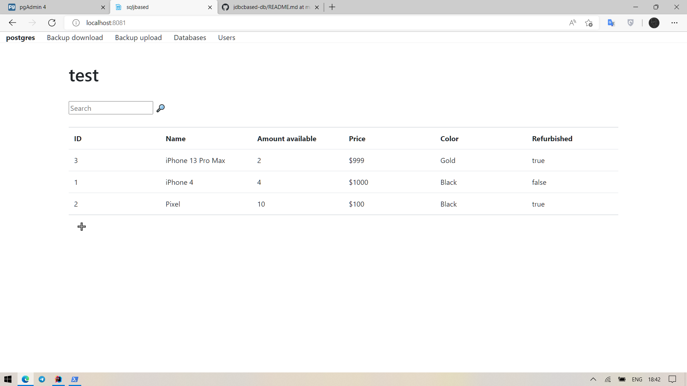

# ```sqljbased-bd```

UI and server for accessing PostgreSQL using ESQL and JNI.

## How I run it

Switch to project
```shell
cd D:/Programs/IntelliJIDEA/sqljbased-db
```

Switch to repositories folder
```shell
cd backend/src/main/java/com/dreamteam/sqljbaseddb/repositories
```

Compile Java code to JNI header, precompile PGC to C, compile C to jnilib
```shell
javac -h ./ NativeAdapter.java |\
 ecpg NativeAdapter.pgc |\
  gcc NativeAdapter.c -o ../../../../../resources/libmylib.jnilib -shared \
  -IC:/Users/rc199/.jdks/openjdk-17.0.2/include \
  -IC:/Users/rc199/.jdks/openjdk-17.0.2/include/win32 \
  -ID:/Programs/PostgreSQL/include \
  -LD:/Programs/PostgreSQL/bin \
  -lecpg
```

And run as usual program

## Screenshots

### Operations with items


Prefilled data


Add item



Item was added


Search


Delete found items


Add item and edit


Item was edited


Delete specific item


Item was deleted


Clear table (will clear table in database)


Table was cleared

## Operations with databases


All databases


System shows databases only with 'jdbc_' prefix


Add new database


Database was added. Table 'items' was added automatically.
I added one item.


Database in pgAdmin


Delete database


Database deleted from system


and from server

### Operations with users


Add user


User was added


Login


User has read-only access to only one database - which
was opened when they were created. If user tries to 
open another database, it will be empty for them.


Database is empty


While 'postgres' (superuser) can see items

### Backups


Backups can be in CSV and in XLSX


CSV backup


XLSX backup

Uploading backup not working since there are issues
with API requests